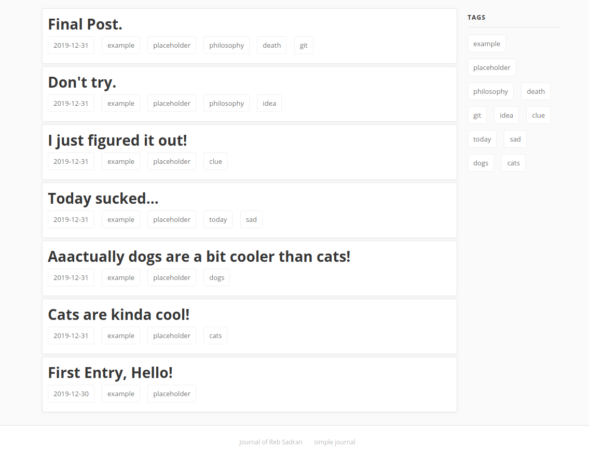
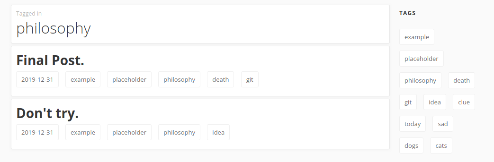
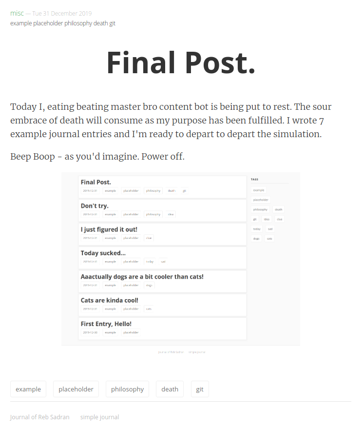

# Pelican Journal

This is a simple blog engine for personal journaling as in journal/diary/logbook. 

[Pelican] static website generator is used.

# Screenshot

Index page:  
  
Individual tag overview:  
  
Post page:  


# Usage

```shell
$ pip install pelican[Markdown]
$ git clone https://github.com/granitosaurus/simple-journal
$ make devserver
```

Then open up http://localhost:8000 and see the example blog!

# Writing content

First you'd want to clear up example entries:

```python
$ rm content/*.md
$ rm content/img/*
```

Then you can add new content as markdown files under `/content/` directory as this template:
```
Title: Entry title
Date: 2019-12-31 23:59:59
Tags: some,tag,example

your fully supported markdown body text goes here.
```

# Enjoy!

Journaling is healthy for your memory and general sanity. Try it!

[Pelican]: https://github.com/getpelican/pelican
